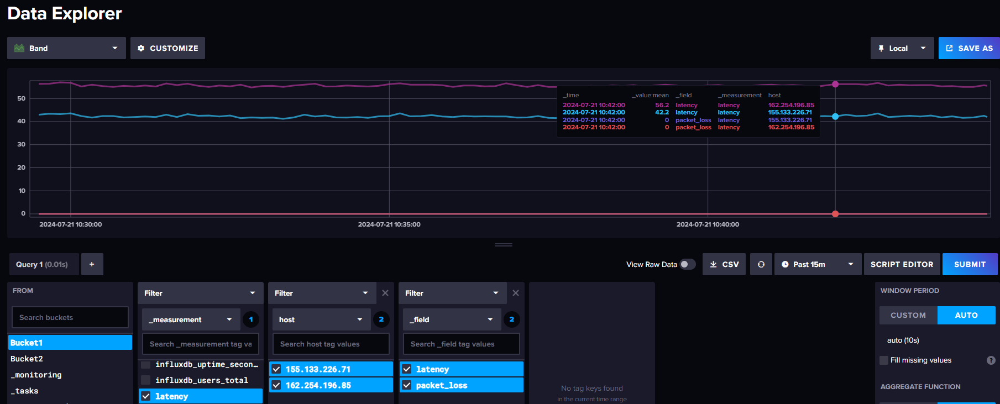

# InfluxDB-Latency-Monitoring
 
This script monitors network latency and packet loss for a list of target IPs and logs the data into InfluxDB. The script performs asynchronous pings and writes the results to an InfluxDB database.

## Prerequisites

- Python 3.7 or later
- InfluxDB 2.x
- Required Python packages:
  - `pythonping`
  - `influxdb-client`

## Installation

1. **Install Python packages:**
   ```sh
   pip install pythonping influxdb-client
   ```
2. **Install and Start InfluxDB:**
- Download and install InfluxDB from the official site.
- Start the InfluxDB service:
   ```sh
    .\influxd.exe
   ```
3. **Get an InfluxDB Token:**
- Open the InfluxDB UI (http://localhost:8086).
- Sign in and go to the "Data" section.
- Under "Tokens", create a new token.
- Copy the generated token and use it in the script.

# Configuration
1. Create a Configuration File:
Create a server_ips_config.txt file with the following format:
   ```r
    menu = CS2-SERVER
    title = CS2-SERVER
    host = 155.133.226.71
    
    menu = CS2-SERVER-2
    title = CS2-SERVER-2
    host = 162.254.196.85
   ```
   
2. Update the Script:
Replace the placeholder in the script with your InfluxDB token:

   ```bash
    client = InfluxDBClient(url="http://localhost:8086", token="YOUR_TOKEN_HERE", org="Networks", debug=False)
   ```
   
# Usage
Run the script:

   ```bash
    python InfluxDB-Latency-Monitor.py
   ```

# Example Output
The script will log the latency and packet loss for each target IP to the InfluxDB database. <br>Below is an example of the data in InfluxDB:



# Notes
- Ensure that the server_ips_config.txt file is in the same directory as the script or provide the correct path.
- Adjust the ping count and timeout values in the ping_target_async function as needed.
- The script updates the InfluxDB every second. Modify the sleep duration in the main function if a different interval is desired.

# License
This project is licensed under the MIT License. See the LICENSE file for details.
